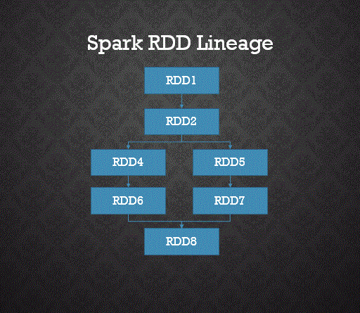
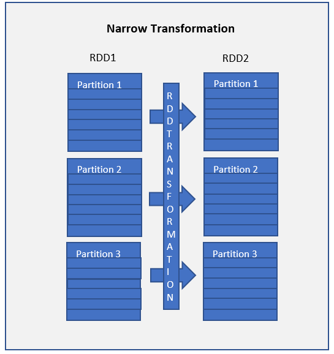
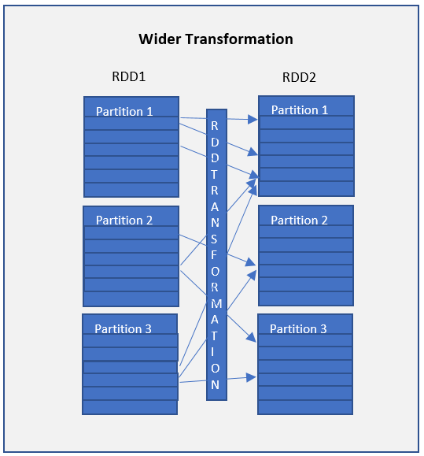
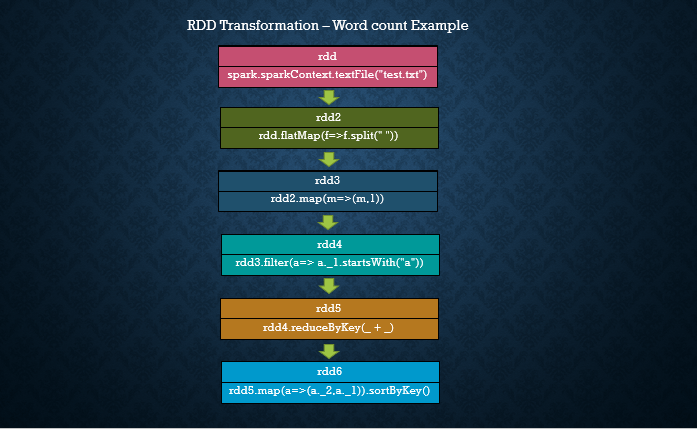
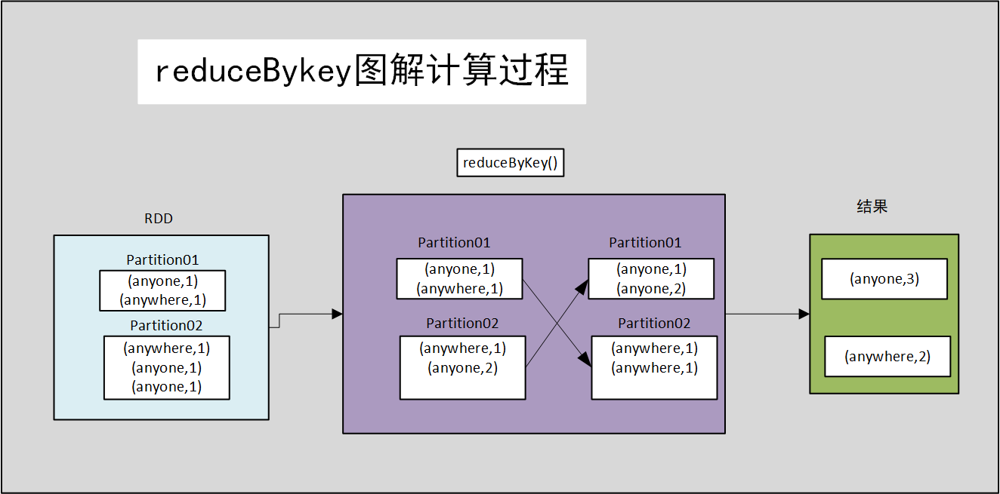

# Spark之 RDD Transformations 案例


> RDD Transformations are Spark operations when executed on RDD, it results in a single or multiple new RDD’s. Since RDD are immutable in nature, transformations always create new RDD without updating an existing one hence, this creates an **RDD lineage**.

RDD 转换是在 RDD 上执行时的 Spark 操作，它会产生一个或多个新的 RDD。 <font color=red>由于 RDD 在本质上是不可变的，因此转换总是会创建新的 RDD 而不会更新现有的 RDD，因此，这会创建一个 **RDD 沿袭**</font>。



<center>RDD Lineage 也称为 RDD 算子图或 RDD 依赖图</center>

## 目录

在本教程中，您将使用 scala 中的 wordcount 示例学习惰性转换、转换类型以及一些转换算子案例。

> In this tutorial, you will learn lazy transformations, types of transformations, a complete list of transformation functions using wordcount example in scala.

- [1 RDD 转换算子是惰性的](#1 RDD 转换算子是惰性的)
- [2 转换算子类型](#2 转换算子类型)
  - [2.1 窄变换算子](#2.1 窄变换算子)
  - [2.2 宽转换算子 ](#2.2 宽转换算子 )
- [3 Spark RDD 转换算子](#3 Spark RDD 转换算子)
- [4 Spark RDD 转换算子案例](#4 Spark RDD 转换算子案例)

## 1 RDD 转换是惰性的

RDD 转换是惰性操作，<font color=red>这意味着在对 Spark RDD 调用行动算子之前，不会执行任何转换算子</font>。 由于 RDD 是不可变的，因此对其进行的任何转换都会导致新的 RDD 保持不变。

> RDD Transformations are lazy operations meaning none of the transformations get executed until you call an action on Spark RDD. Since RDD’s are immutable, any transformations on it result in a new RDD leaving the current one unchanged.

## 2 转换算子类型

### 2.1 窄变换算子

[map()](https://sparkbyexamples.com/apache-spark-rdd/spark-rdd-transformations/#rdd-map) 和 [filter()](https://sparkbyexamples. com/apache-spark-rdd/spark-rdd-transformations/#rdd-filter) 函数和这些计算数据存在于单个分区上，这意味着<font color=red>分区之间不会有任何数据移动来执行窄变换算子</font>。

> Narrow transformations are the result of [map()](https://sparkbyexamples.com/apache-spark-rdd/spark-rdd-transformations/#rdd-map) and [filter()](https://sparkbyexamples.com/apache-spark-rdd/spark-rdd-transformations/#rdd-filter) functions and these compute data that live on a single partition meaning there will not be any data movement between partitions to execute narrow transformations.



> Functions such as `map()`, `mapPartition()`, `flatMap()`, `filter()`, `union()` are some examples of narrow transformation。

诸如`map()`、`mapPartition()`、`flatMap()`、`filter()`、`union()`等函数是窄变换的一些例子。

### 2.2 宽转换算子 

宽转换算子如 *[groupByKey()](https://sparkbyexamples.com/apache-spark-rdd/spark-rdd-transformations/#rdd-groupbykey)* 和 *[reduceByKey()](https:// /sparkbyexamples.com/apache-spark-rdd/spark-rdd-transformations/#rdd-reducebykey)* 函数和这些计算数据存在于许多分区上，<font color=red>这意味着分区之间将进行数据移动以执行宽转换算子</font> 。 由于这些对数据进行了`shuffle `，因此它们也称为`shuffle `转换算子。

> Wider transformations are the result of *[groupByKey()](https://sparkbyexamples.com/apache-spark-rdd/spark-rdd-transformations/#rdd-groupbykey)* and *[reduceByKey()](https://sparkbyexamples.com/apache-spark-rdd/spark-rdd-transformations/#rdd-reducebykey)* functions and these compute data that live on many partitions meaning there will be data movements between partitions to execute wider transformations. Since these shuffles the data, they also called shuffle transformations.



> Functions such as `groupByKey()`, `aggregateByKey()`, `aggregate()`, `join()`, `repartition()` are some examples of a wider transformations.

诸如 `groupByKey()`、`aggregateByKey()`、`aggregate()`、`join()`、`repartition()` 等函数是宽转换算子。

**注意：** 与窄转换相比，由于`shuffling`，宽转换算子是昂贵的操作，也就是耗时较长，性能低。

> **Note:** When compared to Narrow transformations, wider transformations are expensive operations due to shuffling.

## 3 Spark RDD 转换算子

| 转换方法                                                     | 方法使用和说明                                               |
| :----------------------------------------------------------- | :----------------------------------------------------------- |
| [cache()](https://sparkbyexamples.com/apache-spark-rdd/spark-rdd-cache-and-persist-example/) | Caches the RDD（缓存RDD）                                    |
| [filter()](https://sparkbyexamples.com/apache-spark-rdd/spark-rdd-transformations/#rdd-filter) | Returns a new RDD after applying filter function on source dataset.（使用过滤函数返回一个新的RDD） |
| [flatMap()](https://sparkbyexamples.com/apache-spark-rdd/spark-rdd-flatmap-transformation/) | Returns flattern map meaning if you have a dataset with array, it converts each elements in a array as a row. In other words it return 0 or more items in output for each element in dataset.（flat可以将有嵌套的结构展平，map使用定义的函数对每个元素进行处理，也就是映射） |
| [map()](https://sparkbyexamples.com/apache-spark-rdd/spark-rdd-map/) | Applies transformation function on dataset and returns same number of elements in distributed dataset.（map使用定义的函数对每个元素进行处理，也就是映射） |
| mapPartitions()                                              | Similar to map, but executs transformation function on each partition, This gives better performance than map function（和map函数的作用一样，唯一不同的是在每个分区进行） |
| mapPartitionsWithIndex()                                     | Similar to map Partitions, but also provides func with an integer value representing the index of the partition.（和mapPartition函数的作用一样，唯一不同的是会返回元素的索引） |
| randomSplit()                                                | Splits the RDD by the weights specified in the argument. For example rdd.randomSplit(0.7,0.3)（按参数中指定的权重拆分 RDD） |
| union()                                                      | Comines elements from source dataset and the argument and returns combined dataset. This is similar to union function in Math set operations.（从源数据集和参数组合元素并返回组合数据集。 这类似于数学集运算中的联合函数。就是拼接两个数据集） |
| sample()                                                     | Returns the sample dataset.（返回样本数据集。）              |
| intersection()                                               | Returns the dataset which contains elements in both source dataset and an argument（返回包含源数据集中元素和参数的数据集，就求两个RDD交集） |
| distinct()                                                   | Returns the dataset by eliminating all duplicated elements.（去重） |
| [repartition()](https://sparkbyexamples.com/spark/spark-repartition-vs-coalesce/) | Return a dataset with number of partition specified in the argument. This operation reshuffles the RDD randamly, It could either return lesser or more partioned RDD based on the input supplied.（返回具有参数中指定的分区数的数据集。 此操作随机重新洗牌 RDD，它可以根据提供的输入返回更少或更多分区的 RDD。就是重新分区） |
| [coalesce()](https://sparkbyexamples.com/spark/spark-repartition-vs-coalesce/) | Similar to repartition by operates better when we want to the decrease the partitions. Betterment acheives by reshuffling the data from fewer nodes compared with all nodes by repartition.（当我们想要减少分区时，类似于 repartition by 操作更好。 与通过重新分区的所有节点相比，通过重新洗牌来自更少节点的数据来实现改进。） |

## 4 Spark RDD 转换算子案例

在开始之前，让我们通过读取文本文件创建 RDD。 



### 4.1 读取数据

```scala
/**
      * 读取数据
      * 数据样式为：
      * Project Gutenberg’s
        Alice’s Adventures in Wonderland
        by Lewis Carroll
        This eBook is for the use
        of anyone anywhere
        at no cost and with
      * */
    val RDD: RDD[String] = sc.textFile("InData/SparkScalaExampleData/test.txt")
    println("---------打印原始文本前5行------------")
    RDD.collect().take(5).foreach(println)


```

结果：

```scala
---------打印原始文本前5行------------
Project Gutenberg’s
Alice’s Adventures in Wonderland
by Lewis Carroll
This eBook is for the use
of anyone anywhere
```


### 4.2 flatMap() Transformation

在应用函数后，`flatMap()` 转换算子将 RDD 展平并返回一个新的 RDD。 在下面的示例中，首先，它在 RDD 中按空间拆分每条记录，最后将其展平。 生成的 RDD 由每条记录上的一个单词组成。<font color=red>注意查看`map`和`flatmap`的返回类型</font>。

> `flatMap()` transformation flattens the RDD after applying the function and returns a new RDD. On the below example, first, it splits each record by space in an RDD and finally flattens it. Resulting RDD consists of a single word on each record.

```scala
/** flatMap在map操作基础上多了一步，即将内部有嵌套结构去掉，展平 ，具体如下代码所示的返回值*/
    val mapRDD: RDD[Array[String]] = RDD.map(f => f.split(" "))
    //原始文本是以空格划分的，所以在切分时，使用空格切分
    val rdd2: RDD[String] = RDD.flatMap( f=> f.split(" "))
    println("---------打印flatmap文本前5行------------")
    rdd2.collect().take(5).foreach(println)
```

结果：

```scala
---------打印flatmap文本前5行------------
Project
Gutenberg’s
Alice’s
Adventures
in
```


### 4.3 map() Transformation

`map()` 转换用于应用任何复杂的操作，例如添加列、更新列等，`map`转换的<font color=red>输出将始终具有与输入相同数量的记录</font>。

> `map()` transformation is used the apply any complex operations like adding a column, updating a column e.t.c, the output of map transformations would always have the same number of records as input.

```scala
 //改变文本结构，如 "Project"->（"Project",1）
    val rdd3: RDD[(String, Int)] = rdd2.map(m => (m,1))
    println("---------打印(String, Int))文本前5行------------")
    rdd3.collect().take(5).foreach(println)
```

结果：

```scala
---------打印(String, Int))文本前5行------------
(Project,1)
(Gutenberg’s,1)
(Alice’s,1)
(Adventures,1)
(in,1)
```

在我们的单词计数示例中，我们为每个单词添加一个值为 1 的新列，RDD 的结果是 PairRDDFunctions，其中包含键值对，String 类型的单词作为 Key，Int 类型的 1 作为值。

> In our word count example, we are adding a new column with value 1 for each word, the result of the RDD is PairRDDFunctions which contains key-value pairs, word of type String as Key and 1 of type Int as value. For your understanding, I’ve defined rdd3 variable with type.

### 4.4 filter() Transformation

`filter()` 转换用于过滤 RDD 中的记录。 在我们的示例中，我们过滤所有以“a”开头的单词。

> `filter()` transformation is used to filter the records in an RDD. In our example we are filtering all words starts with “a”.

```scala
 //过滤数据
    //将以”a“开头的字母删除,会将删除结果返回
    val rdd4: RDD[(String, Int)] = rdd3.filter(a => a._1.startsWith("a"))
    println("---------打印filter前5行------------")
    rdd4.collect().take(5).foreach(println)
```

结果：

```scala
---------打印filter前5行------------
(anyone,1)
(anywhere,1)
(at,1)
(and,1)
(anyone,1)
```


### 4.5 reduceByKey() Transformation

`reduceByKey()` 将每个键的值与指定的函数合并。 在我们的示例中，它通过<font color=red>对 value 应用 sum 函数来统计单词字符的个数</font>。 我们的 RDD 的结果包含唯一单词及其计数。

> `reduceByKey()` merges the values for each key with the function specified. In our example, it reduces the word string by applying the sum function on value. The result of our RDD contains unique words and their count. 

```scala
//统计每个单词个数
/*
输入数据
(anyone,1)
(anywhere,1)
(at,1)
(and,1)
(anyone,1)
。。。
*/
val rdd5: RDD[(String, Int)] = rdd3.reduceByKey(_ + _)
println("---------打印reduceByKey前5行------------")
rdd5.collect().take(5).foreach(println)
```

结果：

```scala
---------打印reduceByKey前5行------------
(Gutenberg’s,9)
(is,27)
(Lewis,18)
(Wonderland,18)
(anyone,27)
```

图解：



### 4.6 sortByKey() Transformation

`sortByKey()` 转换算子用于对键上的 RDD 元素进行排序。 在我们的示例中，首先，我们使用映射转换将 RDD[(String,Int]) 转换为 RDD[(Int,String]) 并应用 sortByKey，它理想地对整数值进行排序。 最后，带有 println 语句的 foreach 将 RDD 中的所有单词及其计数作为键值对打印到控制台。

> `sortByKey()` transformation is used to sort RDD elements on key. In our example, first, we convert RDD[(String,Int]) to RDD[(Int,String]) using map transformation and apply sortByKey which ideally does sort on an integer value. And finally, foreach with println statement prints all words in RDD and their count as key-value pair to console.

```scala
//先交换位置(String, Int) -> (Int,String)
    //再按照单词出现的次数，即按照key,进行排序
    val rdd6: RDD[(Int, String)] = rdd5.map(a => (a._2,a._1)).sortByKey()
    println("---------打印sortByKey前5行------------")
    rdd6.collect().take(5).foreach(println)
```

结果：

```scala
---------打印sortByKey前5行------------
(9,Gutenberg’s)
(9,Project)
(18,Lewis)
(18,Wonderland)
(18,Carroll)
```


## 5 完整代码

```scala

import org.apache.spark.SparkContext
import org.apache.spark.rdd.RDD
import org.apache.spark.sql.SparkSession

object RDDTransfomersDemo {
  def main(args: Array[String]): Unit = {
    val spark: SparkSession = SparkSession.
      builder()
      .appName("RDDTransfomer")
      .master("local")
      .getOrCreate()

    val sc: SparkContext = spark.sparkContext
    /**
      * 读取数据
      * 数据样式为：
      * Project Gutenberg’s
        Alice’s Adventures in Wonderland
        by Lewis Carroll
        This eBook is for the use
        of anyone anywhere
        at no cost and with
      * */
    val RDD: RDD[String] = sc.textFile("InData/SparkScalaExampleData/test.txt")
    println("---------打印原始文本前5行------------")
    RDD.collect().take(5).foreach(println)

    /** flatMap在map操作基础上多了一步，即将内部有嵌套结构去掉，展平 ，具体如下代码所示的返回值*/
    val flatmapRDD: RDD[Array[String]] = RDD.map(f => f.split(" "))
    //原始文本是以空格划分的，所以在切分时，使用空格切分
    val rdd2: RDD[String] = RDD.flatMap( f=> f.split(" "))
    println("---------打印flatmap文本前5行------------")
    rdd2.collect().take(5).foreach(println)

    //改变文本结构，如 "Project"->（"Project",1）
    val rdd3: RDD[(String, Int)] = rdd2.map(m => (m,1))
    println("---------打印(String, Int))文本前5行------------")
    rdd3.collect().take(5).foreach(println)

    //过滤数据
    //将以”a“开头的字母删除
    val rdd4: RDD[(String, Int)] = rdd3.filter(a => a._1.startsWith("a"))
    println("---------打印filter前5行------------")
    rdd4.collect().take(5).foreach(println)

    //统计每个单词个数
    val rdd5: RDD[(String, Int)] = rdd3.reduceByKey(_ + _)
    println("---------打印reduceByKey前5行------------")
    rdd5.collect().take(5).foreach(println)
    //
    //先交换位置(String, Int) -> (Int,String)
    //再按照单词出现的次数，即按照key,进行排序
    val rdd6: RDD[(Int, String)] = rdd5.map(a => (a._2,a._1)).sortByKey()
    println("---------打印sortByKey前5行------------")
    rdd6.collect().take(5).foreach(println)
  }

}

```

