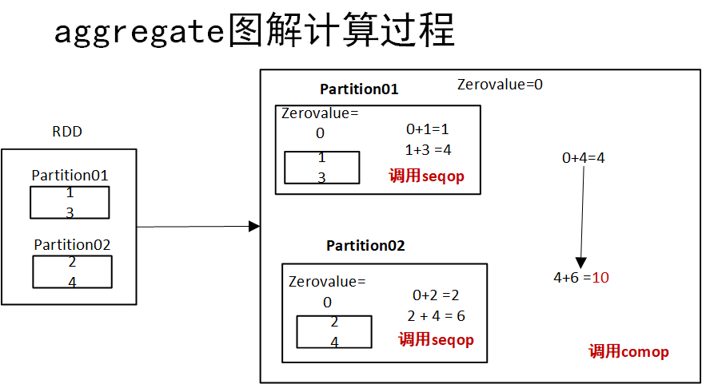
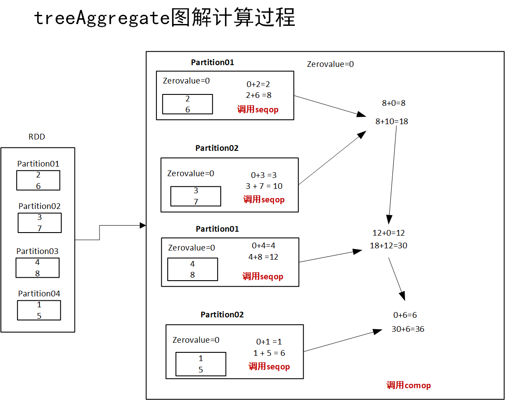
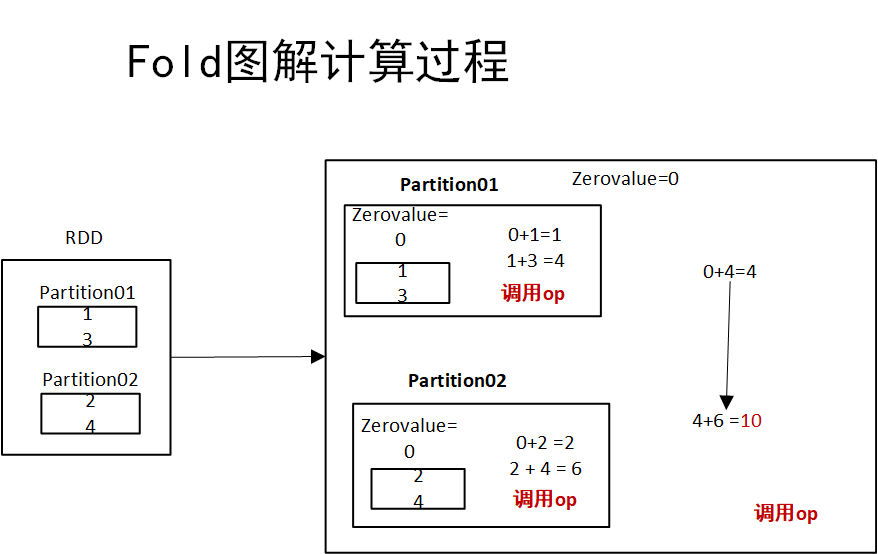
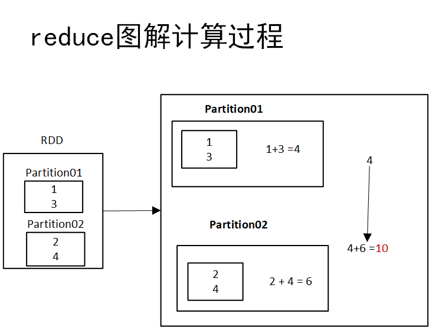
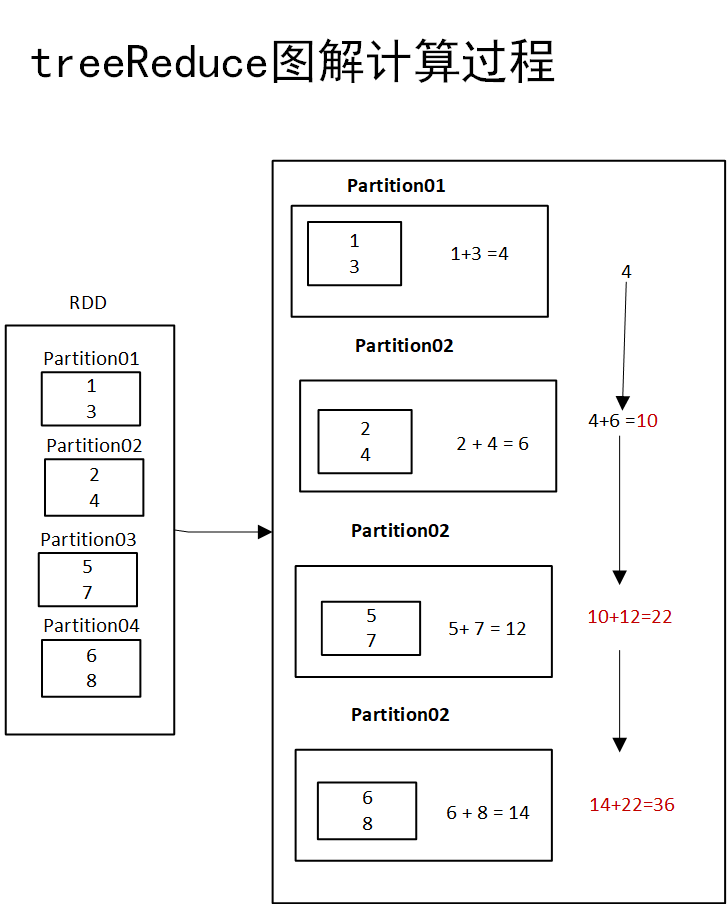

# Spark RDD Actions案例

RDD 行动算子是<font color=red>返回RDD原始值的操作(在集群环境下，要想得到一个RDD的全部内容，就真正执行生成这个RDD的计算逻辑，行动算子表面上看就是返回这个RDD的内容，并没有进行任何转换)</font>，换句话说，任何返回 RDD[T] 以外的 RDD 函数都被视为 Spark 编程中的动作。 在本教程中，我们将通过 Scala 示例学习 RDD 操作。

> RDD actions are operations that return the raw values, In other words, any RDD function that returns other than RDD[T] is considered as an action in spark programming. In this tutorial, we will learn RDD actions with Scala examples.

正如 RDD 转换算子中所述，所有转换算子都是惰性的，这意味着它们不会立即执行，并且会在触发行动算子函数时，才会来正真执行转换 。

> As mentioned in [RDD Transformations](https://sparkbyexamples.com/apache-spark-rdd/spark-rdd-transformations/), all transformations are lazy meaning they do not get executed right away and action functions trigger to execute the transformations.

## 目录


## 1 Spark RDD 行动算子

| 行动算子                                                     | 方法描述                                                     |
| :----------------------------------------------------------- | :----------------------------------------------------------- |
| [aggregate[U](zeroValue: U)(seqOp: (U, T) ⇒ U, combOp: (U, U) ⇒ U)(implicit arg0: ClassTag[U\]): U](https://sparkbyexamples.com/apache-spark-rdd/spark-rdd-actions/#aggregate) | Aggregate the elements of each partition, and then the results for all the partitions.（聚合每个分区的元素，然后聚合所有分区的结果。） |
| [collect():Array[T\]](https://sparkbyexamples.com/apache-spark-rdd/spark-rdd-actions/#collect) | Return the complete dataset as an Array.（将完整的数据集作为数组返回。） |
| [count():Long](https://sparkbyexamples.com/apache-spark-rdd/spark-rdd-actions/#count) | Return the count of elements in the dataset.（返回数据集的总数） |
| [countApprox(timeout: Long, confidence: Double = 0.95): PartialResult[BoundedDouble\]](https://sparkbyexamples.com/apache-spark-rdd/spark-rdd-actions/#count) | Return approximate count of elements in the dataset, this method returns incomplete when execution time meets timeout.（返回数据集中元素的近似计数，当执行时间遇到超时时，此方法返回不完整） |
| [countApproxDistinct(relativeSD: Double = 0.05): Long](https://sparkbyexamples.com/apache-spark-rdd/spark-rdd-actions/#count) | Return an approximate number of distinct elements in the dataset.（返回数据集中不同元素的近似数量。） |
| [countByValue(): Map[T, Long\]](https://sparkbyexamples.com/apache-spark-rdd/spark-rdd-actions/#countByValue) | Return Map[T,Long] key representing each unique value in dataset and value represent count each value present.（返回表示数据集中每个唯一值的 Map[T,Long] 键，值表示对每个存在的值进行计数。） |
| [countByValueApprox(timeout: Long, confidence: Double = 0.95)(implicit ord: Ordering[T\] = null): PartialResult[Map[T, BoundedDouble]]](https://sparkbyexamples.com/apache-spark-rdd/spark-rdd-actions/#countByValue) | Same as countByValue() but returns approximate result.（与 countByValue() 相同，但返回近似结果。） |
| [first():T](https://sparkbyexamples.com/apache-spark-rdd/spark-rdd-actions/#first) | Return the first element in the dataset.（返回数据集第一个元素） |
| [fold(zeroValue: T)(op: (T, T) ⇒ T): T](https://sparkbyexamples.com/apache-spark-rdd/spark-rdd-actions/#fold) | Aggregate the elements of each partition, and then the results for all the partitions.（聚合每个分区的元素，然后聚合所有分区的结果。） |
| [foreach(f: (T) ⇒ Unit): Unit](https://sparkbyexamples.com/apache-spark-rdd/spark-rdd-actions/#foreach) | Iterates all elements in the dataset by applying function f to all elements.（通过将函数 f 应用于所有元素来迭代数据集中的所有元素。） |
| [foreachPartition(f: (Iterator[T\]) ⇒ Unit): Unit](https://sparkbyexamples.com/apache-spark-rdd/spark-rdd-actions/#foreachPartition) | Similar to foreach, but applies function f for each partition.（foreachPartition) 与 foreach 类似，但对每个分区应用函数 f） |
| [min()(implicit ord: Ordering[T\]): T](https://sparkbyexamples.com/apache-spark-rdd/spark-rdd-actions/#min) | Return the minimum value from the dataset.（返回数据集中的最小值。） |
| [max()(implicit ord: Ordering[T\]): T](https://sparkbyexamples.com/apache-spark-rdd/spark-rdd-actions/#max) | Return the maximum value from the dataset.（返回数据集中的最大值。） |
| [reduce(f: (T, T) ⇒ T): T](https://sparkbyexamples.com/apache-spark-rdd/spark-rdd-actions/#reduce) | Reduces the elements of the dataset using the specified binary operator.（使用指定的二元运算符减少数据集的元素。） |
| saveAsObjectFile(path: String): Unit                         | Saves RDD as a serialized object's to the storage system.（将 RDD 作为序列化对象保存到存储系统。） |
| saveAsTextFile(path: String, codec: Class[_ <: CompressionCodec]): Unit | Saves RDD as a compressed text file.（将 RDD 保存为压缩文本文件。） |
| saveAsTextFile(path: String): Unit                           | Saves RDD as a text file.（将 RDD 保存为文本文件。）         |
| [take(num: Int): Array[T\]](https://sparkbyexamples.com/apache-spark-rdd/spark-rdd-actions/#take) | Return the first num elements of the dataset.（返回数据集的前 num 个元素。） |
| [takeOrdered(num: Int)(implicit ord: Ordering[T\]): Array[T]](https://sparkbyexamples.com/apache-spark-rdd/spark-rdd-actions/#take) | Return the first num (smallest) elements from the dataset and this is the opposite of the take() action.  Note: Use this method only when the resulting array is small, as all the data is loaded into the driver's memory.(从数据集中返回第一个 num（最小）元素，这与 take() 操作相反。 注意：仅当结果数组很小时才使用此方法，因为所有数据都加载到驱动程序的内存中。) |
| [takeSample(withReplacement: Boolean, num: Int, seed: Long = Utils.random.nextLong): Array[T\]](https://sparkbyexamples.com/apache-spark-rdd/spark-rdd-actions/#take) | Return the subset of the dataset in an Array. Note: Use this method only when the resulting array is small, as all the data is loaded into the driver's memory.(返回数组中数据集的子集。 注意：仅当结果数组很小时才使用此方法，因为所有数据都加载到驱动程序的内存中。) |
| [toLocalIterator(): Iterator[T\]](https://sparkbyexamples.com/apache-spark-rdd/spark-rdd-actions/#toLocalIterator) | Return the complete dataset as an Iterator. Note: Use this method only when the resulting array is small, as all the data is loaded into the driver's memory.(将完整的数据集作为迭代器返回。 注意：仅当结果数组很小时才使用此方法，因为所有数据都加载到驱动程序的内存中。) |
| [top(num: Int)(implicit ord: Ordering[T\]): Array[T]](https://sparkbyexamples.com/apache-spark-rdd/spark-rdd-actions/#top) | Return top n elements from the dataset,Note: Use this method only when the resulting array is small, as all the data is loaded into the driver's memory.(从数据集中返回前 n 个元素，注意：仅当结果数组很小时才使用此方法，因为所有数据都加载到驱动程序的内存中。) |
| [treeAggregate](https://sparkbyexamples.com/apache-spark-rdd/spark-rdd-actions/#treeAggregate) | Aggregates the elements of this RDD in a multi-level tree pattern.(以多级树模式聚合此 RDD 的元素。) |
| [treeReduce](https://sparkbyexamples.com/apache-spark-rdd/spark-rdd-actions/#treeReduce) | Reduces the elements of this RDD in a multi-level tree pattern.(以多级树模式减少此 RDD 的元素。) |

## 2 RDD行动算子案例

> Before we start explaining RDD actions with examples, first, let’s create an RDD.

在开始许学习RDD行动算子案例之前，创建的如下的RDD.

```scala
  /** 准备数据*/
val inputRDD: RDD[(String, Int)] = spark.sparkContext.parallelize(List(("Z", 1),("A", 20),("B", 30),("C", 40),("B", 30),("B", 60)))
val listRdd: RDD[Int] = spark.sparkContext.parallelize(List(1,2,3,4,5,3,2))
println("inputRDD的分区书数为：" + inputRDD.getNumPartitions)
println("listRdd的分区数为：" + listRdd.getNumPartitions)
```

### 1 aggregate – action

`aggregate()` the elements of each partition, and then the results for all the partitions.

**功能：**按照规则同时进行分区内的计算和分区间的计算。

**源码：**

```scala
* @param zeroValue `seqOp` 运算符的每个分区的累积结果的初始值，以及 `combOp` 运算符的不同分区的组合结果的初始值 - 这通常是中性元素（例如 ` Nil 用于列表连接或 0 用于求和）
    * @param seqOp 用于在分区内累积结果的运算符
    * @param combOp 一个关联运算符，用于组合来自不同分区的结果
    */
  def aggregate[U: ClassTag](zeroValue: U)(seqOp: (U, T) => U, combOp: (U, U) => U): U = withScope 
```

有三个参数：

- 初始值：zeroValue
- 分区内的计算规则:seqOp
- 分区间的计算规则:combOp

分区的数据通过初始值和分区内的数据进行聚合，然后再和初始值进行分区间的数据聚合，具体操作过程如下图所示：（**注意：**初始值使用了两次）

#### 图解计算过程



假设有一个RDD，这个RDD有两个分区，给定初始值０，使用aggregate算子进行计算时，首先在每个分区内调用函数seqop进行计算，在分区1最终计算结果为4，分区2最终计算结果为6，最后调用comop函数合并每个分区的计算结果。

#### 案例1

该案例所用RDD已在文章开头创建。

```scala
/** aggregate算子*/

  /*  def seqOp(s1:Int, s2:Int):Int = {
      println("seq计算时的输入值: "+s1+":"+s2)
      s1 + s2
    }

    def combOp(c1: Int, c2: Int): Int = {
      println("comb的计算时的输入值: "+c1+":"+c2)
      c1 + c2
    }*/
    //分区内的函数seqOP和param0等价，分区间函数combOp和param1等价，param0是函数简写形式
    def param0 = (accu:Int,v:Int) => accu + v
    def param1 = (accu1:Int,accu2:Int) => accu1 + accu2

    val aggResult: Int = listRdd.aggregate(0)(param0,param1)
    println("aggreagate计算结果" + aggResult)
 
//案例2
    //由于inputRDD的每个元素为元组，故参数应写成v:(String,Int)，accu这里可以理解为初始值，v为RDD的元素
    def param3 = (accu:Int,v:(String,Int)) => accu + v._2
    def param4 = (accu1:Int,accu2:Int) => accu1 + accu2
    val reAgg: Int = inputRDD.aggregate(0)(param3,param4)
    println("案例2 aggreagate计算结果" + aggResult)
```

#### 案例2

具体代码为：

```scala
    def seqOp(s1:Int, s2:Int):Int = {
      println("seq计算时的输入值: "+s1+":"+s2)
      s1 + s2
    }

    def combOp(c1: Int, c2: Int): Int = {
      println("comb的计算时的输入值: "+c1+":"+c2)
      c1 + c2
    }
    val rdd: RDD[Int] = sc.parallelize(1 to 8).repartition(4)
    val res: Int = rdd.rdd.aggregate(0)(seqOp,combOp)
    //val res: Int = rdd.aggregate(0)(seqOp,combOp)
    println(res)
```

结果：

```scala
seq计算时的输入值: 0:2
seq计算时的输入值: 2:6
comb的计算时的输入值: 0:8
comb的计算时的输入值: 0:8
seq计算时的输入值: 0:3
seq计算时的输入值: 3:7
comb的计算时的输入值: 0:10
comb的计算时的输入值: 8:10
seq计算时的输入值: 0:4
seq计算时的输入值: 4:8
comb的计算时的输入值: 0:12
comb的计算时的输入值: 18:12
seq计算时的输入值: 0:1
seq计算时的输入值: 1:5
comb的计算时的输入值: 0:6
comb的计算时的输入值: 30:6
36
```

### 2 treeAggregate – action

`treeAggregate()` – Aggregates the elements of this RDD in a multi-level tree pattern. The output of this function will be similar to the aggregate function.

**功能：**按照规则同时进行分区内的计算和分区间的计算。treeAggregate和aggregate功能一样。

**源码：**

```scala
 def treeAggregate[U: ClassTag](zeroValue: U)(
      seqOp: (U, T) => U,
      combOp: (U, U) => U,
      depth: Int = 2): U = withScope {
```

有三个参数：

- 初始值：zeroValue
- 分区内的计算规则:seqOp
- 分区间的计算规则:combOp

treeAggregate在aggregate的基础上做了一些优化，因为aggregate是在每个分区计算完成后，把所有的数据**拉倒driver端**，进行统一的遍历合并，这样如果数据量很大，在driver端可能会OOM。

#### 图解计算过程：



**与aggregate不同的是treeAggregate多了depth的参数，其他参数含义相同。aggregate在执行完SeqOp后会将计算结果拿到driver端使用CombOp遍历一次SeqOp计算的结果，最终得到聚合结果。而treeAggregate不会一次就Comb得到最终结果，SeqOp得到的结果也许很大，直接拉到driver可能会OutOfMemory，因此它会先把分区的结果做局部聚合(reduceByKey)，如果分区数过多时会做分区合并，之后再把结果拿到driver端做reduce。**

**注：与aggregate不同的地方是：在每个分区，会做两次或者多次combOp，避免将所有局部的值传给driver端。另外，初始值zeroValue不会参与combOp。**

#### 案例1

```scala
/** treeAggregate 算子*/
def param8 = (accu:Int,v:Int) => accu +v
def param9 = (accu1:Int,accu2:Int) => accu1 + accu2
val treeAggreResult: Int = listRdd.treeAggregate(0)(param8,param9)
println(" treeAggregate计算结果" + aggResult)
```

#### 案例2

```scala

import org.apache.spark.SparkContext
import org.apache.spark.rdd.RDD
import org.apache.spark.sql.SparkSession

object treeAggregateDemo {
  def main(args: Array[String]): Unit = {
    val spark: SparkSession = SparkSession.builder()
      .appName("treeAggregate")
      .master("local")
      .getOrCreate()

    val sc: SparkContext = spark.sparkContext

    def seqOp(s1:Int, s2:Int):Int = {
      println("seq计算时的输入值: "+s1+":"+s2)
      s1 + s2
    }

    def combOp(c1: Int, c2: Int): Int = {
      println("comb的计算时的输入值: "+c1+":"+c2)
      c1 + c2
    }
    val rdd: RDD[Int] = sc.parallelize(1 to 8).repartition(4)
    val res: Int = rdd.aggregate(0)(seqOp,combOp)
    //val res: Int = rdd.aggregate(0)(seqOp,combOp)
    println(res)

  }

}
```

### 3  fold – action

`fold()` – Aggregate the elements of each partition, and then the results for all the partitions.

聚合每个分区的元素，然后聚合所有分区的结果。

**功能：**和aggregate一样，是aggregate 的简化版操作,即分区内的操作和分区间的函数一样。

**源码：**

```
/* @param zeroValue 为 `op` 算子的每个分区的累加结果的初始值，也是来自不同的组合结果的初始值`op` 运算符的分区 - 这通常是中性的元素（例如，用于列表连接的“Nil”或用于求和的“0”）
   * @param op 一个运算符，用于在分区内累积结果并组合来自不同分区的结果
   */
  def fold(zeroValue: T)(op: (T, T) => T): T = withScope {
```

**有两个个参数：**

- 初始值：zeroValue
- 分区内的计算规则和分区间的计算规则:op

#### 图解计算过程：



**注意**：初始值会一直分区内和分区间的计算。

#### 案例1

```scala
/** fold 行动算子*/
// fold 案例1
val foldRes: Int = listRdd.fold(0) { (acc, v) =>
val sum: Int = acc + v
sum
}
println("案例1 fold行动算子计算结果：" + foldRes)

//案例2，传入匿名函数，只需指定输入参数即可。
val foldRes2: (String, Int) = inputRDD.fold(("Total", 0)) { (acc: (String, Int), v: (String, Int)) =>
val sum = acc._2 + v._2
("Total", sum)
}
println("案例2 fold算子结果" + foldRes2)
```

#### 案例2

```scala
import org.apache.spark.{SparkConf, SparkContext}

object aggregate {
  def main(args: Array[String]): Unit = {
    val sparkConf = new SparkConf().setMaster("local[*]").setAppName("Operator")
    val sc = new SparkContext(sparkConf)

    val rdd = sc.makeRDD(List(1,2,3,4),2)//指定分区数为2
    /*val newRDD = rdd.aggregate(10)(_+_,_+_)*/
    val newRDD = rdd.fold(10)(_+_)
    println(newRDD)
  }

}
结果：40
```


### 4 reduce

`reduce()` – Reduces the elements of the dataset using the specified binary operator.

**功能**：聚集 RDD 中的所有元素，先聚合分区内数据，再聚合分区间数据

**源码：**

```scala
def reduce(f: (T, T) => T):
```

**有一个参数：**f:(T,T) => T 表示具体计算的函数，应用于每个元素。

#### 图解计算过程




#### 案例1：

```scala
/** reduce 算子*/
//案例1
val reduceRes: Int = listRdd.reduce(_ + _)
println("reduce算子计算结果：" + reduceRes)
//案例2
val reduceRes2: Int = listRdd.reduce((x,y) => x + y)
println("reduce算子计算结果：" + reduceRes2)
//案例3
val res3: (String, Int) = inputRDD.reduce((x,y) => ("Total",x._2 + y._2))
println("案例3reduce计算结果" + res3)
```

#### 案例2

```scala
import org.apache.spark.{SparkConf, SparkContext}

object reduce {
  def main(args: Array[String]): Unit = {
    val sparkConf = new SparkConf().setMaster("local[*]").setAppName("Operator")
    val sc = new SparkContext(sparkConf)

    val rdd = sc.makeRDD(List(1,2,3,4),2)

    val newRDD = rdd.reduce(_+_)
    println(newRDD)
  }

}
结果：10
```


### 5 treeReduce

`treeReduce()` – Reduces the elements of this RDD in a multi-level tree pattern.

**功能**：聚集 RDD 中的所有元素，先聚合分区内数据，再聚合分区间数据,功能和reduce一样，其在reduce基础上优化了，reduce在每个分区计算完成后，会把结果直接拉到driver端，要是计算结果过大，容易造成OOM，因此treeReduce会先合并几个分区的计算结果，逐步得到最终结果。

**源码：**

```scala
def reduce(f: (T, T) => T):
```

**有一个参数：**f:(T,T) => T 表示具体计算的函数，应用于每个元素。



#### 案例1

```scala
 /** treeReduce 算子*/
val treeReduceRes: Int = listRdd.treeReduce(_ + _)
println("treeReduce的计算结果：" + treeAggreResult)
```

#### 案例2

```scala
import org.apache.spark.{SparkConf, SparkContext}
object treeReduceDemo {
  def main(args: Array[String]): Unit = {
    val sparkConf = new SparkConf().setMaster("local[*]").setAppName("Operator")
    val sc = new SparkContext(sparkConf)
    val rdd = sc.makeRDD(List(1,2,3,4,5,6,7,8),4)
    val sumnum: Int = rdd.treeReduce(_+_)
    println(sumnum)

  }

}
```

### 6 collect

`collect()` -Return the complete dataset as an Array.

**功能：**返回完整的数据，以数组的方式。

#### 案例

```scala
 /** collect*/
val data: Array[Int] = listRdd.collect()
data.foreach(println)
```

### 7 count, countApprox, countApproxDistinct

`count()` – Return the count of elements in the dataset.

**功能:**统计数据集元素的个数，一般是指行数。


`countApprox()` – Return approximate count of elements in the dataset, this method returns incomplete when execution time meets timeout.

**功能:**count() 的近似版本，即使并非所有任务都已完成，也会在超时内返回可能不完整的结果。

**源码：**

```scala
/**
    * count() 的近似版本，即使并非所有任务都已完成，也会在超时内返回可能不完整的结果。
    *
    * 置信度是结果的误差范围包含真实值的概率。 也就是说，如果 countApprox 以 0.9 的置信度重复调用，我们预计 90% 的结果包含真实计数。 置信度必须在 [0,1] 范围内，否则将引发异常。
    * @param timeout 等待作业的最长时间，以毫秒为单位
    * @param confidence 结果中所需的统计置信度
    * @return 一个可能不完整的结果，带有错误界限
    */
  def countApprox(
      timeout: Long,
      confidence: Double = 0.95): PartialResult[BoundedDouble] =
```


`countApproxDistinct()` – Return an approximate number of distinct elements in the dataset.

**功能:**返回 RDD 中不同元素(去重)的近似数量，一般是指行数。

#### 案例

```scala
 /** count, countApprox, countApproxDistinct行动算子*/
println("listRDD 的总数为：" + listRdd.count())
println("listRDD 的近似总数为：" + listRdd.countApprox(1200))

println("listRDD 的近似总数为" + listRdd.countApproxDistinct())
println("inputRDD 的近似总数为" + inputRDD.countApproxDistinct())
```

### 8 countByValue, countByValueApprox

功能：返回一个Map[T,Long],T表示数据集中每个唯一值，long(Value)表示对这个唯一值进行计数。

>  `countByValue()` – Return Map[T,Long] key representing each unique value in dataset and value represents count each value present.

`countByValueApprox()` – Same as countByValue() but returns approximate result.

功能：和countByValue一样，只是返回的是近似数。

#### 案例

```scala
/** countByValue, countByValueApprox*/

val countvalueRDD: collection.Map[Int, Long] = listRdd.countByValue()
println("countByValue的计算结果" + countvalueRDD)
```


### 9 first

`first()` – Return the first element in the dataset.

功能：**返回RDD中的第一个元素**

#### 案例

```scala
 /** first 行动算子*/
println("listRDD 的第一个元素是：" + listRdd.first())
println("inputRDD 的第一个元素是：" + inputRDD.first())
```


### 10 top

`top()` – Return top n elements from the dataset.

Note: Use this method only when the resulting array is small, as all the data is loaded into the driver’s memory.

**功能：**返回数据集中的前n个元素**(从大到小)**。注意是在排序后的基础上返回的。

#### 案例

```scala
/** top 行动算子*/
val topResult: Array[Int] = listRdd.top(2)
print("返回前2个元素" + topResult.mkString(","))
val inputRDDTop: Array[(String, Int)] = inputRDD.top(2)
println("返回inputRDD的前两个元素：" + inputRDDTop)
```

### 11 min

`min()` – Return the minimum value from the dataset.

**功能：**返回数据集的最小值

### 12 max

`max()` – Return the maximum value from the dataset.

**功能：**返回数据集的最大值

#### 案例

```scala
  /** min算子 max算子*/

//min
println("min :  "+listRdd.min())
//Output: min :  1
println("min :  "+inputRDD.min())
//Output: min :  (A,20)


//max
println("max :  "+listRdd.max())
//Output: max :  5
println("max :  "+inputRDD.max())
//Output: max :  (Z,1)
```


### 13 take, takeOrdered, takeSample

`take()` – Return the first num elements of the dataset.

功能：返回RDD 的前 n 个元素组成的数组。


`takeOrdered()` – Return the first num (smallest) elements from the dataset and this is the opposite of the take() action. 
Note: Use this method only when the resulting array is small, as all the data is loaded into the driver’s memory.

功能：从数据集中返回 num个（最小）元素，这与 top() 操作相反。

注意：仅当结果数组很小时才使用此方法，因为所有数据都加载到驱动程序的内存中。

```scala
 * For example:
   * {{{
   *   sc.parallelize(Seq(10, 4, 2, 12, 3)).takeOrdered(1)
   *   // returns Array(2)
   *
   *   sc.parallelize(Seq(2, 3, 4, 5, 6)).takeOrdered(2)
   *   // returns Array(2, 3)
   * }}}
```

`takeSample()` – Return the subset of the dataset in an Array.

**功能：**返回数组中数据集的子集。

**源码：**

```scala
/**
    * 在数组中返回此 RDD 的固定大小的采样子集
    *
    * @param withReplacement 是否通过替换完成采样
    * @param num 返回样本的大小
    * @param seed 随机数生成器的种子
    * @return 数组中指定大小的样本
    *
    * @note 仅当预期结果数组很小时才应使用此方法，因为
    * 所有数据都加载到驱动程序的内存中。
    */
  def takeSample(
      withReplacement: Boolean,
      num: Int,
      seed: Long = Utils.random.nextLong): Array[T] = 
```

Note: Use this method only when the resulting array is small, as all the data is loaded into the driver’s memory.

#### 案例

```scala
/** take ,takeordered ,takeSample*/
println("take:" + listRdd.take(2).mkString(","))
println("takeOrdered:" + listRdd.takeOrdered(2).mkString(","))
val slice: Array[Int] = listRdd.takeSample(true,3,300)
println("listRdd的子集：" + slice.mkString(","))

```

### 完整代码

```scala

import org.apache.spark.rdd.RDD
import org.apache.spark.sql.SparkSession

object RDDActionDemo {

  def main(args: Array[String]): Unit = {

    val spark: SparkSession = SparkSession
      .builder()
      .appName("anctionDemo")
      .master("local")
      .getOrCreate()

    spark.sparkContext.setLogLevel("ERROR")
    /** 准备数据*/
    val inputRDD: RDD[(String, Int)] = spark.sparkContext.parallelize(List(("Z", 1),("A", 20),("B", 30),("C", 40),("B", 30),("B", 60)))
    val listRdd: RDD[Int] = spark.sparkContext.parallelize(List(1,2,3,4,5,3,2))
    println("inputRDD的分区书数为：" + inputRDD.getNumPartitions)
    println("listRdd的分区数为：" + listRdd.getNumPartitions)
    /** aggregate算子*/

  /*  def seqOp(s1:Int, s2:Int):Int = {
      println("seq计算时的输入值: "+s1+":"+s2)
      s1 + s2
    }

    def combOp(c1: Int, c2: Int): Int = {
      println("comb的计算时的输入值: "+c1+":"+c2)
      c1 + c2
    }*/
    //分区内的函数seqOP和param0等价，分区间函数combOp和param1等价，param0是函数简写形式
    def param0 = (accu:Int,v:Int) => accu + v
    def param1 = (accu1:Int,accu2:Int) => accu1 + accu2

    val aggResult: Int = listRdd.aggregate(0)(param0,param1)
    println("案例1 aggreagate计算结果" + aggResult)

    //案例2

    def param3 = (accu:Int,v:(String,Int)) => accu + v._2
    def param4 = (accu1:Int,accu2:Int) => accu1 + accu2

    val reAgg: Int = inputRDD.aggregate(0)(param3,param4)
    println("案例2 aggreagate计算结果" + aggResult)

    /** treeAggregate 算子*/

    def param8 = (accu:Int,v:Int) => accu +v
    def param9 = (accu1:Int,accu2:Int) => accu1 + accu2
    val treeAggreResult: Int = listRdd.treeAggregate(0)(param8,param9)
    println(" treeAggregate计算结果" + aggResult)

    /** fold 行动算子*/
    // fold 案例1
    val foldRes: Int = listRdd.fold(0) { (acc, v) =>
      val sum: Int = acc + v
      sum
    }
    println("案例1 fold行动算子计算结果：" + foldRes)

    //案例2
    val foldRes2: (String, Int) = inputRDD.fold(("Total", 0)) { (acc: (String, Int), v: (String, Int)) =>
      val sum = acc._2 + v._2
      ("Total", sum)
    }
    println("案例2 fold算子结果" + foldRes2)

    /** reduce 算子*/
    //案例1
    val reduceRes: Int = listRdd.reduce(_ + _)
    println("reduce算子计算结果：" + reduceRes)
    //案例2
    val reduceRes2: Int = listRdd.reduce((x,y) => x + y)
    println("reduce算子计算结果：" + reduceRes2)
    //案例3
    val res3: (String, Int) = inputRDD.reduce((x,y) => ("Total",x._2 + y._2))
    println("案例3reduce计算结果" + res3)

    /** treeReduce 算子*/
    val treeReduceRes: Int = listRdd.treeReduce(_ + _)
    println("treeReduce的计算结果：" + treeAggreResult)

    /** collect*/
    val data: Array[Int] = listRdd.collect()
    data.foreach(println)

    /** count, countApprox, countApproxDistinct行动算子*/
    println("listRDD 的总数为：" + listRdd.count())
    println("listRDD 的近似总数为：" + listRdd.countApprox(1200))

    println("listRDD 的近似总数为" + listRdd.countApproxDistinct())
    println("inputRDD 的近似总数为" + inputRDD.countApproxDistinct())

    /** countByValue, countByValueApprox*/

    val countvalueRDD: collection.Map[Int, Long] = listRdd.countByValue()
    println("countByValue的计算结果" + countvalueRDD)

    /** first 行动算子*/
    println("listRDD 的第一个元素是：" + listRdd.first())
    println("inputRDD 的第一个元素是：" + inputRDD.first())

    /** top 行动算子*/
    val topResult: Array[Int] = listRdd.top(2)
    println("返回前2个元素" + topResult.mkString(","))
    val inputRDDTop: Array[(String, Int)] = inputRDD.top(2)
    println("返回inputRDD的前两个元素：" + inputRDDTop)


    /** min算子 max算子*/

    //min
    println("min :  "+listRdd.min())
    //Output: min :  1
    println("min :  "+inputRDD.min())
    //Output: min :  (A,20)


    //max
    println("max :  "+listRdd.max())
    //Output: max :  5
    println("max :  "+inputRDD.max())
    //Output: max :  (Z,1)

    /** take ,takeordered ,takeSample*/
    println("take:" + listRdd.take(2).mkString(","))
    println("takeOrdered:" + listRdd.takeOrdered(2).mkString(","))
    val slice: Array[Int] = listRdd.takeSample(true,3,300)
    println("listRdd的子集：" + slice.mkString(","))

    

  }

}
```

