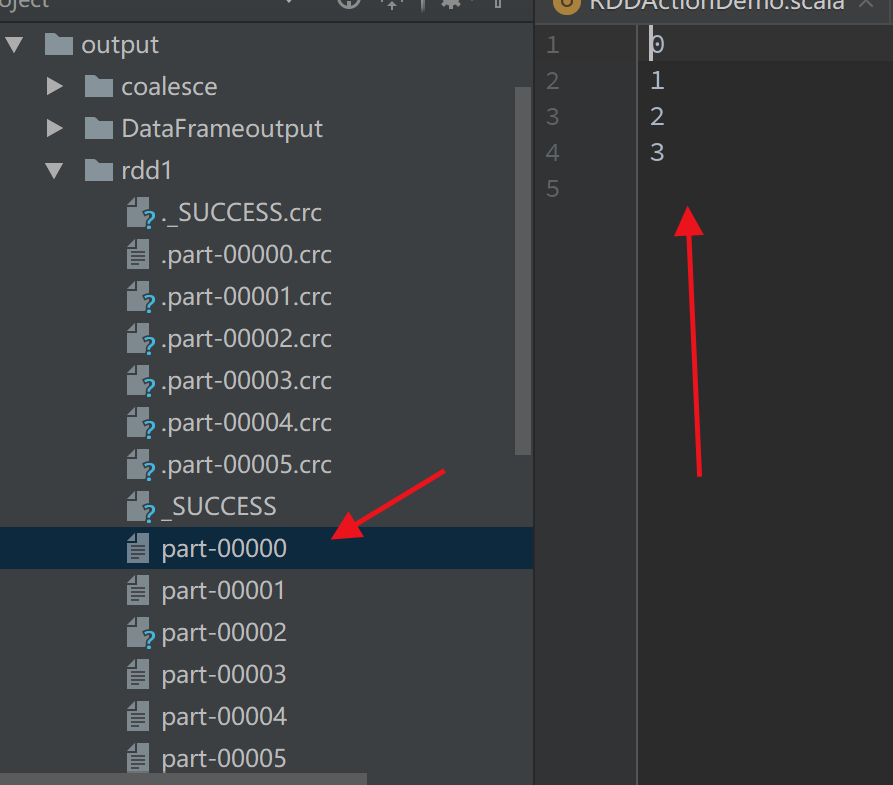
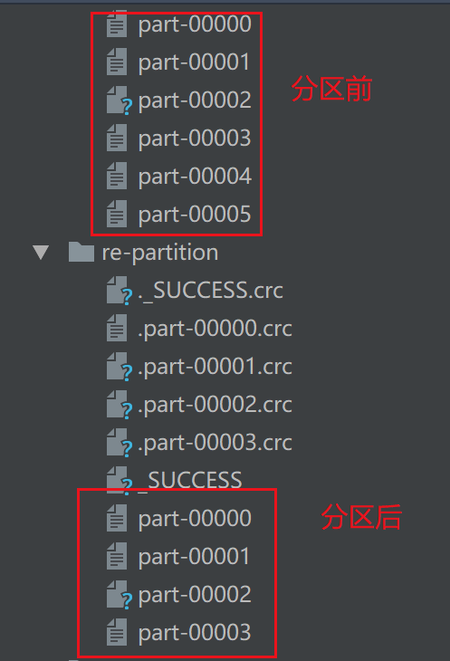
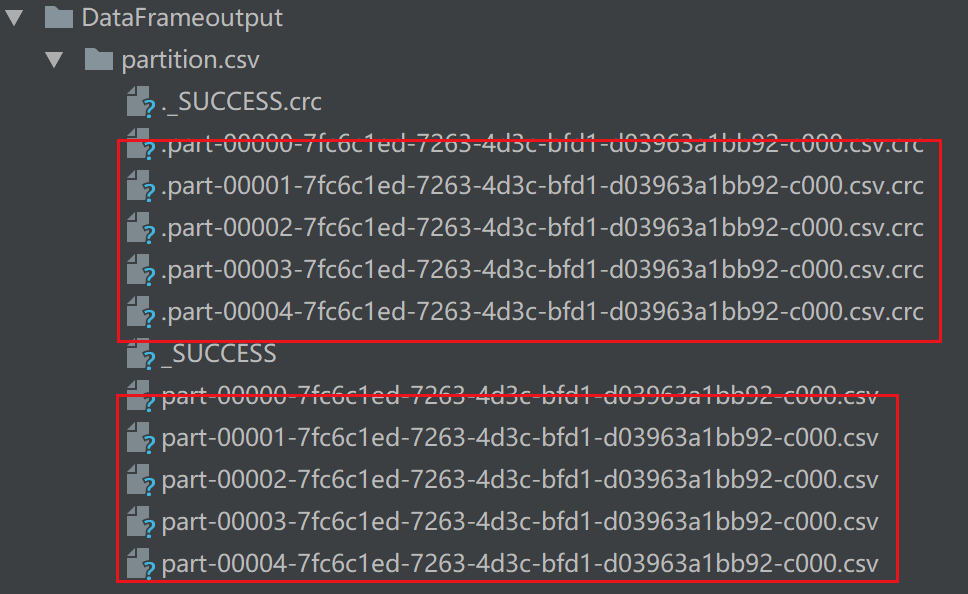

# Spark 之分区算子Repartition() vs Coalesce()

Spark `repartition()` vs `coalesce()` - repartition() <font color=red>用于增加或减少 RDD、DataFrame、Dataset 分区，而 coalesce() 仅用于有效减少分区数量</font>。

> Spark `repartition()` vs `coalesce()` – repartition() is used to increase or decrease the RDD, DataFrame, Dataset partitions whereas the coalesce() is used to only decrease the number of partitions in an efficient way.

在本文中，您将了解什么是 Spark `repartition()` 和 `coalesce()` 方法？ 以及重新分区与合并与 Scala 示例之间的区别。

> In this article, you will learn what is Spark `repartition()` and `coalesce()` methods? and the difference between repartition vs coalesce with Scala examples.

## 目录

- 1. Spark 之RDD repartition() vs coalesce()

  - [RDD repartition](#1.1 RDD repartition())
  - [RDD coalesce](#1.2 RDD coalesce())
- 2. Spark 之DataFrame repartition() vs coalesce()

  - [DataFrame repartition](#2.1 DataFrame repartition())
  - [DataFrame coalesce](#2.2 DataFrame coalesce())

<font color=red>需要注意的重要一点是</font>，Spark `repartition()` 和`coalesce()` 是效率低下的操作，因为它们会在许多分区中打乱数据，因此尽量减少重新分区。

> One important point to note is, Spark `repartition()` and` coalesce()` are very expensive operations as they shuffle the data across many partitions hence try to minimize repartition as much as possible.


## 1. Spark RDD repartition() vs coalesce()

在 RDD 中，您可以使用 [parallelize( )](https://sparkbyexamples.com/apache-spark-rdd/how-to-create-an-rdd-using-parallelize/), [textFile()](https://sparkbyexamples.com/apache-spark -rdd/spark-read-multiple-text-files-into-a-single-rdd/) 和 [wholeTextFiles()](https://sparkbyexamples.com/apache-spark-rdd/spark-read-multiple-text -files-into-a-single-rdd/)创建RDD。

> In RDD, you can create parallelism at the time of the [creation of an RDD](https://sparkbyexamples.com/apache-spark-rdd/different-ways-to-create-spark-rdd/) using [parallelize()](https://sparkbyexamples.com/apache-spark-rdd/how-to-create-an-rdd-using-parallelize/), [textFile()](https://sparkbyexamples.com/apache-spark-rdd/spark-read-multiple-text-files-into-a-single-rdd/) and [wholeTextFiles()](https://sparkbyexamples.com/apache-spark-rdd/spark-read-multiple-text-files-into-a-single-rdd/). 

```scala
val spark: SparkSession = SparkSession.builder()
.appName("partitionDemo")
.master("local[5]")
.getOrCreate()
//创建RDD，
val rdd: RDD[Int] = spark.sparkContext.parallelize(Range(0,20))
println("From local[5]:" + rdd.partitions.size)

//创建RDD并指定分区数
val rdd1: RDD[Int] = spark.sparkContext.parallelize(Range(0,25),6)
println("parallelize:" + rdd1.partitions.size)
//从本地读取数据,并指定分区数
val rddFromFile: RDD[String] = spark.sparkContext.textFile("InData/SparkScalaExampleData/test.txt",10)
println("TextFile:" + rddFromFile.partitions.size)
```

结果：

```
From local[5]:5
parallelize:6
TextFile:10
```

`spark.sparkContext.parallelize(Range(0,25),6)`将RDD分成6个分区，数据分布如下。

> `spark.sparkContext.parallelize(Range(0,25),6)` distributes RDD into 6 partitions and the data is distributed as below.



### 1.1 RDD repartition()

Spark RDD repartition() 方法用于<font color=red>增加或减少分区</font>。 下面的示例通过从所有分区移动数据将分区从 10 减少到 4。

> Spark RDD repartition() method is used to increase or decrease the partitions. The below example decreases the partitions from 10 to 4 by moving data from all partitions.

```scala
/** repartition */
val rdd2: RDD[Int] = rdd1.repartition(4)
println("Repartition size:" + rdd2.partitions.size)
//保存
rdd2.saveAsTextFile("data/output/re-partition")
```

如果您将以下输出与第 1 部分进行比较，您会注意到文件减少了两个。

> If you compared the below output with section 1, you will notice partition 3 has been moved to 2 and Partition 6 has moved to 5, resulting data movement from just 2 partitions.



### 1.2 RDD coalesce()

> Spark RDD `coalesce()` 仅用于减少分区数量。 <font color=red>这是 `repartition()` 的优化或改进版本</font>，其中使用合并的数据在分区之间的移动较低。

> Spark RDD `coalesce()` is used only to reduce the number of partitions. This is optimized or improved version of `repartition()` where the movement of the data across the partitions is lower using coalesce.

```scala
/** coalesce分区算子*/
val rdd3: RDD[Int] = rdd1.coalesce(4)
println("Repartition size:" + rdd3.partitions.size)
//保存
rdd3.saveAsTextFile("data/output/coalesce")
```

## 2. Spark DataFrame repartition() vs coalesce()

> Unlike RDD, you can’t specify the partition/parallelism while [creating DataFrame](https://sparkbyexamples.com/spark/different-ways-to-create-a-spark-dataframe/). DataFrame or Dataset by default uses the methods specified in Section 1 to determine the default partition and splits the data for parallelism.

与 RDD 不同，在 [创建DataFrame](https://sparkbyexamples.com/spark/different-ways-to-create-a-spark-dataframe/) **时不能指定分区/并行性**。 默认情况下，DataFrame 或 Dataset 使用第 1 节中指定的方法来确定默认分区并拆分数据以实现并行性。


```scala
/**
*
* dataframe repartition coalesce
* */

val df: Dataset[lang.Long] = spark.range(0,20)
println(df.rdd.partitions.length)

df.write.mode(SaveMode.Overwrite)csv("data/output/DataFrameoutput/partition.csv")
```

> The above example creates 5 partitions as specified in `master("local[5]")` and the data is distributed across all these 5 partitions.

上面的示例创建了 master("local[5]") 中指定的 5 个分区，并且数据分布在所有这 5 个分区中。



### 2.1 DataFrame repartition()

> Similar to RDD, the Spark DataFrame repartition() method is used to increase or decrease the partitions. The below example increases the partitions from 5 to 6 by moving data from all partitions.

与 RDD 类似，Spark DataFrame repartition() 方法用于增加或减少分区。 下面的示例通过从所有分区移动数据将分区从 5 增加到 6。

```scala
/**2.1 dataframe repartition*/
val df2: Dataset[lang.Long] = df.repartition(6)
println(df2.rdd.partitions.length)
```

> Just increasing 1 partition results data movements from all partitions.

**注意：**仅增加 1 个分区就会导致所有分区的数据移动。

> And, even decreasing the partitions also results in moving data from all partitions. hence when you wanted to decrease the partition recommendation is to use coalesce()

而且，有时即使减少分区也会导致从所有分区移动数据。 因此，当您想减少分区时，建议使用 coalesce()

### 2.2 DataFrame coalesce()

> Spark DataFrame `coalesce()` is used only to decrease the number of partitions. This is an optimized or improved version of repartition() where the movement of the data across the partitions is fewer using coalesce.

Spark DataFrame `coalesce()` 仅用于减少分区数。 这是 repartition() 的优化或改进版本，其中使用合并的数据在分区之间的移动更少。

```scala
/** dataframe coalesce*/
    val df3: Dataset[lang.Long] = df.coalesce(2)
    println(df3.rdd.partitions.length)
```

This yields output 2 and the resultant partition looks like:

```scala
Partition 1 : 0 1 2 3 8 9 10 11
Partition 2 : 4 5 6 7 12 13 14 15 16 17 18 19
```

## 默认分区Default Shuffle Partition

> Calling `groupBy()`, `union()`, `join()` and similar functions on DataFrame results in shuffling data between multiple executors and even machines and finally repartitions data into **200 partitions by default**. Spark default defines shuffling partition to 200 using `spark.sql.shuffle.partitions` configuration.

在 DataFrame 上调用 `groupBy()`、`union()`、`join()` 和类似函数会导致在多个 executor 甚至机器之间打乱数据，最终将数据重新分区到 **200 个默认分区**。 Spark 默认使用 `spark.sql.shuffle.partitions` 配置将混洗分区定义为 200。

```scala
 /** default shuffle Partition*/
    val df4: DataFrame = df.groupBy("id").count()
    println(df4.rdd.getNumPartitions)
```

## 完整代码：

```scala
package sparkScalaExamples.RDD

import java.lang

import org.apache.spark.rdd.RDD
import org.apache.spark.sql.{DataFrame, Dataset, SaveMode, SparkSession}

object PartitionDemo {
  def main(args: Array[String]): Unit = {
    val spark: SparkSession = SparkSession.builder()
      .appName("partitionDemo")
      .master("local[5]")
      .getOrCreate()
    //创建RDD，
    val rdd: RDD[Int] = spark.sparkContext.parallelize(Range(0,20))
    println("From local[5]" + rdd.partitions.size)

    //创建RDD并指定分区数
    val rdd1: RDD[Int] = spark.sparkContext.parallelize(Range(0,25),6)
    println("parallelize" + rdd1.partitions.size)
    //从本地读取数据,并指定分区数
    val rddFromFile: RDD[String] = spark.sparkContext.textFile("InData/SparkScalaExampleData/test.txt",10)
    println("TextFile:" + rddFromFile.partitions.size)

    rdd1.saveAsTextFile("data/output/rdd1")//每次运行的时候，将rdd1文件夹删除，不然会报错
    /** repartition */
    val rdd2: RDD[Int] = rdd1.repartition(4)
    println("Repartition size:" + rdd2.partitions.size)
    rdd2.saveAsTextFile("data/output/re-partition")

    /** coalesce分区算子*/
    val rdd3: RDD[Int] = rdd1.coalesce(4)
    println("Repartition size:" + rdd3.partitions.size)
    rdd3.saveAsTextFile("data/output/coalesce")

    /**
      *
      * dataframe repartition coalesce
      * */

    val df: Dataset[lang.Long] = spark.range(0,20)
    println(df.rdd.partitions.length)

    df.write.mode(SaveMode.Overwrite)csv("data/output/DataFrameoutput/partition.csv")

    /**2.1 dataframe repartition*/
    val df2: Dataset[lang.Long] = df.repartition(6)
    println(df2.rdd.partitions.length)

    /** dataframe coalesce*/
    val df3: Dataset[lang.Long] = df.coalesce(2)
    println(df3.rdd.partitions.length)

    /** default shuffle Partition*/
    val df4: DataFrame = df.groupBy("id").count()
    println(df4.rdd.getNumPartitions)


  }
}
```

结果：

```scala
From local[5]5
parallelize6
TextFile:10
Repartition size:4
Repartition size:4
5
6
2
200
```


## 总结

> In this Spark repartition and coalesce article, you have learned how to create an RDD with partition, repartition the RDD & DataFrame using repartition() and coalesce() methods, and learned the difference between repartition and coalesce.

在这篇 Spark repartition and coalesce 文章中，您学习了如何使用分区创建 RDD，使用 repartition() 和 coalesce() 方法对 RDD 和 DataFrame 进行重新分区，并了解了 repartition 和 coalesce 之间的区别。

