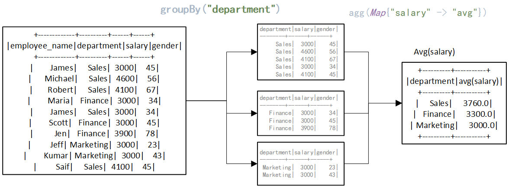

## groupBy

groupBy该函数经常和agg方法组合使用，一般处理步骤是，先使用groupBy指定列进行分组，最后使用agg方法进行聚合操作，如求平均值、计算总数、最大值、最小值等。

```
/**
 *使用指定的列对数据集进行分组，以便我们可以对它们运行聚合。
  * 有关所有可用的聚合函数，请参阅 [[RelationalGroupedDataset]]。
  *
  * 这是 groupBy 的变体，只能使用列名按现有列分组
  *（即不能构造表达式）。
 *
 * {{{
 *   // 计算按部门分组的所有数字列的平均值。
 *   ds.groupBy("department").avg()
 *
 *   // 计算按部门和性别分组的最大年龄和平均工资。
 *   ds.groupBy($"department", $"gender").agg(Map(
 *     "salary" -> "avg",
 *     "age" -> "max"
 *   ))
 * }}}
 
```

## agg

一般是在groupBy分组后的基础上进行聚合计算：如`avg`, `max`, `min`, `sum`, `count`.，

```scala
/**
*（Scala-specific）通过指定列名和计算聚合
    * 聚合方法。 生成的 `DataFrame` 也将包含分组列。
   *
   * The available aggregate methods are `avg`, `max`, `min`, `sum`, `count`.
   * {{{
   *   // 选择最年长员工的年龄和每个部门的总费用
   *   df.groupBy("department").agg(
   *     "age" -> "max",
   *     "expense" -> "sum"
   *   )
   * }}}
   *
   */

```

下面以如下数据所示，以部门为划分依据，求每个部门的工资平均值，描述groupBy和agg的用法：

**数据：**

```scala
---------原始数据集：--------
原始数据行数：10
+-------------+----------+------+------+
|employee_name|department|salary|gender|
+-------------+----------+------+------+
|        James|     Sales|  3000|    45|
|      Michael|     Sales|  4600|    56|
|       Robert|     Sales|  4100|    67|
|        Maria|   Finance|  3000|    34|
|        James|     Sales|  3000|    34|
|        Scott|   Finance|  3000|    45|
|          Jen|   Finance|  3900|    78|
|         Jeff| Marketing|  3000|    23|
|        Kumar| Marketing|  3000|    43|
|         Saif|     Sales|  4100|    45|
+-------------+----------+------+------+

```

**需求：**

求每个部门的工资平均值

**图解groupBy和agg方法：**



如上图所示，dataframe调用groupBy("department")后，会按照"department"的值将数据划分为不同的数据块，最后会依据agg指定的方法对划分后的数据进行聚合操作。

## 案例

```scala
package sparkScalaExamples.RDD

import org.apache.spark.sql.{DataFrame, SparkSession}

object GroupByDemo {
  def main(args: Array[String]): Unit = {
    val spark: SparkSession = SparkSession.builder().appName("groupBY").master("local").getOrCreate()

    import spark.implicits._

    val simpleData = Seq(("James", "Sales", 3000,45),
      ("Michael", "Sales", 4600,56),
      ("Robert", "Sales", 4100,67),
      ("Maria", "Finance", 3000,34),
      ("James", "Sales", 3000,34),
      ("Scott", "Finance", 3000,45),
      ("Jen", "Finance", 3900,78),
      ("Jeff", "Marketing", 3000,23),
      ("Kumar", "Marketing", 3000,43),
      ("Saif", "Sales", 4100,45)
    )
    val df = simpleData.toDF("employee_name", "department", "salary","gender")
    println("---------原始数据集：--------")
    println("原始数据行数："+df.count())
    df.show()
    /**
      * 1 以部门为划分依据，求每个部门的工资平均值，
      * */
    val avgdf: DataFrame = df.groupBy("department").avg()//avg会计算分组后所有数值型数据的平均值
    avgdf.show()
    println("指定聚合后需要计算的列")
    df.groupBy("department").agg(Map{"salary" -> "avg"}).show()
    // 计算按部门和性别分组的最大年龄和平均工资。
    //aga可以使用map方式，指定每一个列处理的方法，常见的方法有：
    //avg`, `max`, `min`, `sum`, `count`
    val aggDF: DataFrame = df.groupBy($"department", $"gender").agg(Map {
      "salary" -> "avg"//要是指定分组后没有数据进行计算，则不会计算该对应的方法
      "gender" -> "max"
    })
    aggDF.show()
    //选择最年长员工的年龄和每个部门的总总共工资
    val df2: DataFrame = df.groupBy("department").agg(Map {
      "gender" -> "max"
      "salary" -> "sum"//
    })
    df2.show()
    /**
      * 统计每个部门的最大年龄
      * */
    df.groupBy("department").agg(Map {
      "gender" -> "max"
      //"salary" -> "sum"//
    }).show()


  }

}

```

