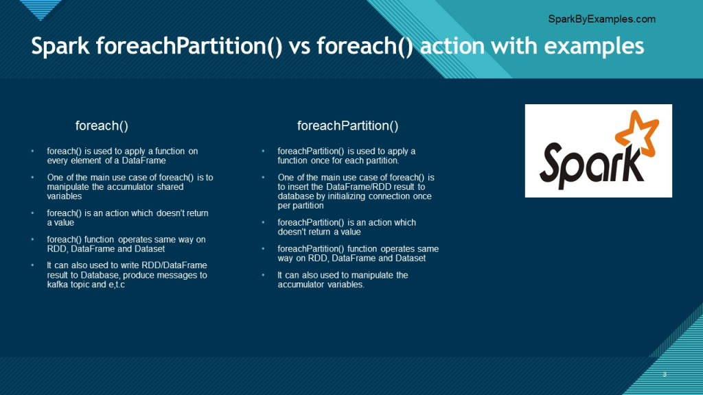

# Spark之foreachPartition VS foreach如何使用？

在 Spark 中，当您进行<font color=red>大量初始化（如数据库连接）并希望每个分区初始化一次时，使用 foreachPartition()，其中 foreach() 用于在 RDD/DataFrame/Dataset 分区的每个元素上应用一个函数</font>。

> In Spark `foreachPartition()` is used when you have a heavy initialization (like database connection) and wanted to initialize once per partition where as foreach() is used to apply a function on every element of a RDD/DataFrame/Dataset partition.

在这篇 Spark Dataframe 文章中，您将了解 foreachPartiton 的用途以及与同级 foreach（foreachPartiton 与 foreach）函数的区别。

> In this Spark Dataframe article, you will learn what is foreachPartiton used for and the differences with its sibling foreach (foreachPartiton vs foreach) function.

Spark foreachPartition 是一个动作操作，在 RDD、DataFrame 和 Dataset 中可用。 这与其他操作不同，因为 foreachPartition() 函数不返回值，而是在每个分区上执行输入函数。

> Spark foreachPartition is an action operation and is available in RDD, DataFrame, and Dataset. This is different than other actions as foreachPartition() function doesn’t return a value instead it executes input function on each partition.


# 目录
- 1 [DataFrame foreachPartition()应用案例]()
- 2 [DataFrame foreach() 应用案例]()
- 3 [RDD foreachPartition() 应用案例]()
- 4 [RDD foreach() 应用案例]()



## DataFrame foreachPartition()应用案例

在 Spark DataFrame 上，`foreachPartition()` 类似于<font color=red>用于操作累加器、写入数据库表或外部数据源的 `foreach()` 操作，但不同之处在于 foreachPartiton() 为您提供了一个选项</font>，可以对每个操作进行大量初始化 每个分区都被认为是最有效的。

> On Spark DataFrame `foreachPartition()` is similar to `foreach()` action which is used to manipulate the accumulators, write to a database table or external data sources but the difference being foreachPartiton() gives you an option to do heavy initializations per each partition and is consider most efficient.

### Syntax

```scala
foreachPartition(f : scala.Function1[scala.Iterator[T], scala.Unit]) : scala.Unit
```

当 foreachPartition() 应用于 Spark DataFrame 时，它会为 DataFrame 上的每个分区执行 foreach() 中指定的函数。 此操作主要用于将 DataFrame 结果保存到 RDBMS 表，或将其生成到 kafka 主题等

> When foreachPartition() applied on Spark DataFrame, it executes a function specified in foreach() for each partition on DataFrame. This operation is mainly used if you wanted to save the DataFrame result to RDBMS tables, or produce it to kafka topics e.t.c

### Example

In this example, to make it simple we just print the DataFrame to console.

```scala
  // foreachPartition DataFrame
  val df = spark.createDataFrame(data).toDF("Product","Amount","Country")
  df.foreachPartition(partition => {
    //Initialize database connection or kafka
    partition.foreach(fun=>{
      //apply the function to insert the database 
      // or produce kafka topic
    })
    //If you have batch inserts, do here.
  })
```

## DataFrame foreach() Usage

When `foreach()` applied on Spark DataFrame, it executes a function specified in for each element of DataFrame/Dataset. This operation is mainly used if you wanted to `<a href="https://sparkbyexamples.com/spark/spark-accumulators/">manipulate accumulators</a>`, and any other operations which doesn’t have heavy initializations.


```scala
  val longAcc = spark.sparkContext.longAccumulator("SumAccumulator")
  df.foreach(f=> {
    longAcc.add(f.getInt(1))
  })
  println("Accumulator value:"+longAcc.value)
```

## RDD foreachPartition() Usage

foreach() on RDD behaves similarly to DataFrame equivalent hence, it has the same syntax.

### Syntax

```scala
foreachPartition(f : scala.Function1[scala.Iterator[T], scala.Unit]) : scala.Unit
```

### Example

```scala
  // foreachPartition DataFrame
  val rdd = spark.sparkContext.parallelize(Seq(1,2,3,4,5,6,7,8,9))
  rdd.foreachPartition(partition => {
    //Initialize any database connection
    partition.foreach(fun=>{
      //apply the function
    })
  })
```

## Spark RDD foreach() Usage

rdd foreach() is equivalent to DataFrame foreach() action.

```scala
  //rdd accumulator
  val rdd2 = spark.sparkContext.parallelize(Seq(1,2,3,4,5,6,7,8,9))
  val longAcc2 = spark.sparkContext.longAccumulator("SumAccumulator2")
  rdd .foreach(f=> {
    longAcc2.add(f)
  })
  println("Accumulator value:"+longAcc2.value)
```

## 完整代码


## Conclusion

You should use foreachPartition action operation when using heavy initialization like database connections or Kafka producer etc where it initializes one per partition rather than one per element(foreach). foreach() transformation mostly used to update accumulator variables.

