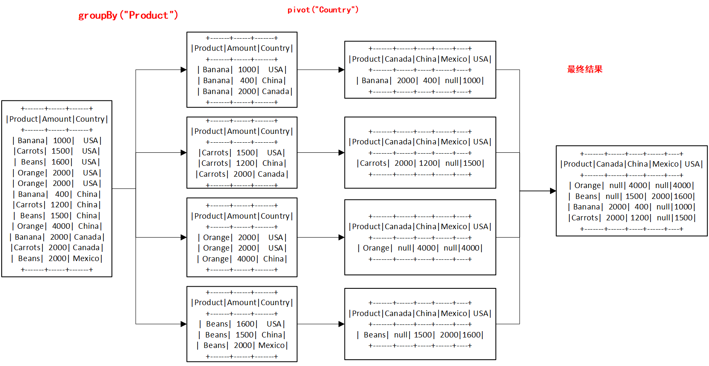

# spark 将列(行)转为行（列）

> Spark pivot() function is used to pivot/rotate the data from one DataFrame/Dataset column into multiple columns (transform row to column) and unpivot is used to transform it back (transform columns to rows).

<font color=red>Spark pivot() 函数用于将数据从一个 DataFrame/Dataset 列旋转/旋转为多列（将行转换为列），unpivot 用于将其转换回来（将列转换为行）</font>。

> In this article, I will explain how to use pivot() SQL function to transpose one or multiple rows into columns.

在本文中，我将解释如何使用 pivot() SQL 函数将一行或多行转置为列。

> Pivot() is an aggregation where one of the grouping columns values transposed into individual columns with distinct data.

Pivot() 是一种聚合，其中一个分组列值转换为具有不同数据的单个列。

## 目录

- [1 准备数据](#1 准备数据)
- [2 Pivot Spark DataFrame列转行](#2 Pivot Spark DataFrame列转行)
- [3 Spark DataFrame行转列](#3 Spark DataFrame行转列)
- [4 无聚合的转置或旋转](#4 无聚合的转置或旋转)
- [5 总结Conclusion](#5 总结Conclusion)

## 准备数据

Let’s create a DataFrame to work with.

```scala
val data = Seq(("Banana",1000,"USA"), ("Carrots",1500,"USA"), ("Beans",1600,"USA"),
      ("Orange",2000,"USA"),("Orange",2000,"USA"),("Banana",400,"China"),
      ("Carrots",1200,"China"),("Beans",1500,"China"),("Orange",4000,"China"),
      ("Banana",2000,"Canada"),("Carrots",2000,"Canada"),("Beans",2000,"Mexico"))

import spark.sqlContext.implicits._
val df = data.toDF("Product","Amount","Country")
df.show()
```

DataFrame 'df' 由 3 列 Product、Amount 和 Country 组成，如下所示。

```scala
原始数据：
+-------+------+-------+
|Product|Amount|Country|
+-------+------+-------+
| Banana|  1000|    USA|
|Carrots|  1500|    USA|
|  Beans|  1600|    USA|
| Orange|  2000|    USA|
| Orange|  2000|    USA|
| Banana|   400|  China|
|Carrots|  1200|  China|
|  Beans|  1500|  China|
| Orange|  4000|  China|
| Banana|  2000| Canada|
|Carrots|  2000| Canada|
|  Beans|  2000| Mexico|
+-------+------+-------+
```

## Pivot Spark DataFrame列转行

> Spark SQL provides `pivot()` function to rotate the data from one column into multiple columns (transpose row to column). It is an aggregation where one of the grouping columns values transposed into individual columns with distinct data. From the above DataFrame, to get the total amount exported to each country of each product will do group by Product, pivot by Country, and the sum of Amount.

<font color=red>Spark SQL 提供 `pivot()` 函数将数据从一列旋转到多列（将行转置到列）</font>。 它是一种聚合，其中一个分组列值转换为具有不同数据的单个列。 从上面的DataFrame中，要得到每个产品出口到每个国家的总金额，将按产品分组，按国家数据透视，以及金额的总和。

```scala
/**
      * 2
      * 以Product为分组依据，将分组后的数据，以Country列的之为新的列名
      * */
    val pivotDF: DataFrame = df.groupBy("Product").pivot("Country").sum("Amount")
    println("Product为分组依据，将分组后的数据，以Country列的之为新的列名：")
    pivotDF.show()
    //val dataset: RelationalGroupedDataset = df.groupBy("Product").pivot("Country")
```

> This will transpose the countries from DataFrame rows into columns and produces below output. Where ever data is not present, it represents as null by default.

这会将国家/地区从 DataFrame 行转换为列并产生以下输出。 如果数据不存在，默认情况下它表示为 null。

```bash
+-------+------+-----+------+----+
|Product|Canada|China|Mexico| USA|
+-------+------+-----+------+----+
| Orange|  null| 4000|  null|4000|
|  Beans|  null| 1500|  2000|1600|
| Banana|  2000|  400|  null|1000|
|Carrots|  2000| 1200|  null|1500|
```

**图解Pivot处理过程：**




## Spark 2.0 中的 Pivot 性能改进

> Spark 2.0 on-wards performance has been improved on Pivot, however, if you are using lower version; note that pivot is a very expensive operation hence, it is recommended to provide column data (if known) as an argument to function as shown below.

Spark 2.0 以后的性能在 Pivot 上得到了改进，但是，如果您使用的是较低版本； 请注意，pivot 是一项非常耗时的操作，因此，<font color=red>建议提供列数据（如果已知）作为函数的参数</font>，如下所示。

```scala
/**
      * 3
      * 指定转换后的列名顺序
      * */
    val countries = Seq("USA","China","Canada","Mexico")
    val framespark2: DataFrame = df.groupBy("Product").pivot("Country",countries).sum("Amount")
    println("指定转换后的列名顺序:")
    framespark2.show()
```

> Another approach is to do two-phase aggregation. Spark 2.0 uses this implementation in order to improve the performance [Spark-13749](https://issues.apache.org/jira/browse/SPARK-13749)

另一种方法是进行两阶段聚合。 Spark 2.0 使用此实现来提高性能 [Spark-13749](https://issues.apache.org/jira/browse/SPARK-13749)

```scala
 /**4
      * 进行两阶段聚合,以提高性能
      * */
    val frame: DataFrame = df.groupBy("Product", "Country")
      .sum("Amount")
      .groupBy("Product")
      .pivot("Country")
      .sum("sum(Amount)")
    println("进行两段聚合：")
    frame.show()
```

> Above two examples returns the same output but with better performance.

以上两个示例返回相同的输出，但性能更好。

## Spark DataFrame行转列

> Unpivot is a reverse operation, we can achieve by rotating column values into rows values. Spark SQL doesn’t have unpivot function hence will use the `stack()` function. Below code converts  row countries to column.

Unpivot 是一种反向操作，我们可以通过将列值旋转为行值来实现。 Spark SQL 没有 unpivot 函数，因此将使用 `stack()` 函数。 下面的代码将行国家转换为列。

```scala
/**
      * 5 行转列
      *
      * */
    val unPivotDF: Dataset[Row] = pivotDF.select($"Product",
      expr("stack(3,'Canada',Canada,'China',China,'Mexico',Mexico) as (Country,Total)"))
      .where("Total is not null")
    println("-------------------")
    pivotDF.show()
    println("---转换后的----------")
    unPivotDF.show()

```

It converts pivoted column “country” to rows.

```scala
+-------+-------+-----+
|Product|Country|Total|
+-------+-------+-----+
| Orange|  China| 4000|
|  Beans|  China| 1500|
|  Beans| Mexico| 2000|
| Banana| Canada| 2000|
| Banana|  China|  400|
|Carrots| Canada| 2000|
|Carrots|  China| 1200|
+-------+-------+-----+
```

## 无聚合的转置或旋转

> **Can we do Spark DataFrame transpose or pivot without aggregation?**

<font color=red>**我们可以在没有聚合的情况下进行 Spark DataFrame 转置或旋转吗？**</font>

> of course you can, but unfortunately, you can’t achieve using Pivot function. However, pivoting or transposing DataFrame structure without aggregation from rows to columns and columns to rows can be easily done using Spark and Scala hack. please refer to [this](https://stackoverflow.com/questions/49392683/transpose-dataframe-without-aggregation-in-spark-with-scala) example.

当然可以，但不幸的是，使用 Pivot 功能无法实现。 但是，使用 Spark 和 Scala hack 可以轻松完成对 DataFrame 结构进行透视或转置，而无需从行到列以及从列到行的聚合。 请参考 [this](https://stackoverflow.com/questions/49392683/transpose-dataframe-without-aggregation-in-spark-with-scala)示例。

## 总结Conclusion

> We have seen how to Pivot DataFrame (transpose row to column) with scala example and Unpivot it back using Spark SQL functions. And also have seen how Spark 2.0 changes improves performance by doing two-phase aggregation.

我们已经看到了如何使用 scala 示例对 DataFrame 进行透视（将行转换为列）并使用 Spark SQL 函数将其还原。 并且还看到了 Spark 2.0 如何通过两阶段聚合来提高性能。


